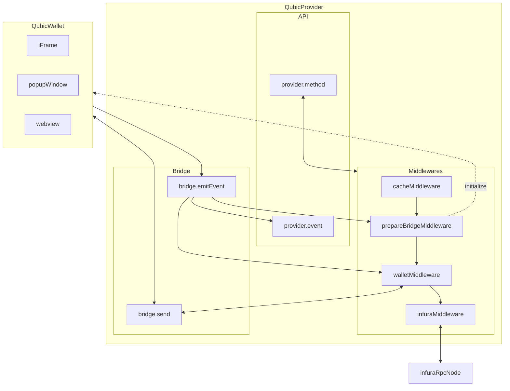

### Provider structure

```mermaid
flowchart TB
  subgraph QubicProvider
    subgraph API
      provider.method
      provider.event
    end
    provider.method <--> Middlewares
    subgraph Middlewares
      cacheMiddleware --> prepareBridgeMiddleware
      prepareBridgeMiddleware --> walletMiddleware
      walletMiddleware --> infuraMiddleware
    end
    walletMiddleware <--> bridge.send
    subgraph Bridge
      bridge.emitEvent
      bridge.send
    end
    bridge.emitEvent --> prepareBridgeMiddleware
    bridge.emitEvent --> walletMiddleware
    bridge.emitEvent --> provider.event
  end
  infuraMiddleware <--> infuraRpcNode
  subgraph QubicWallet
    iFrame
    popupWindow
    webview
  end
  QubicWallet --> bridge.emitEvent
  QubicWallet <--> bridge.send
  prepareBridgeMiddleware -.->|initialize| QubicWallet
```