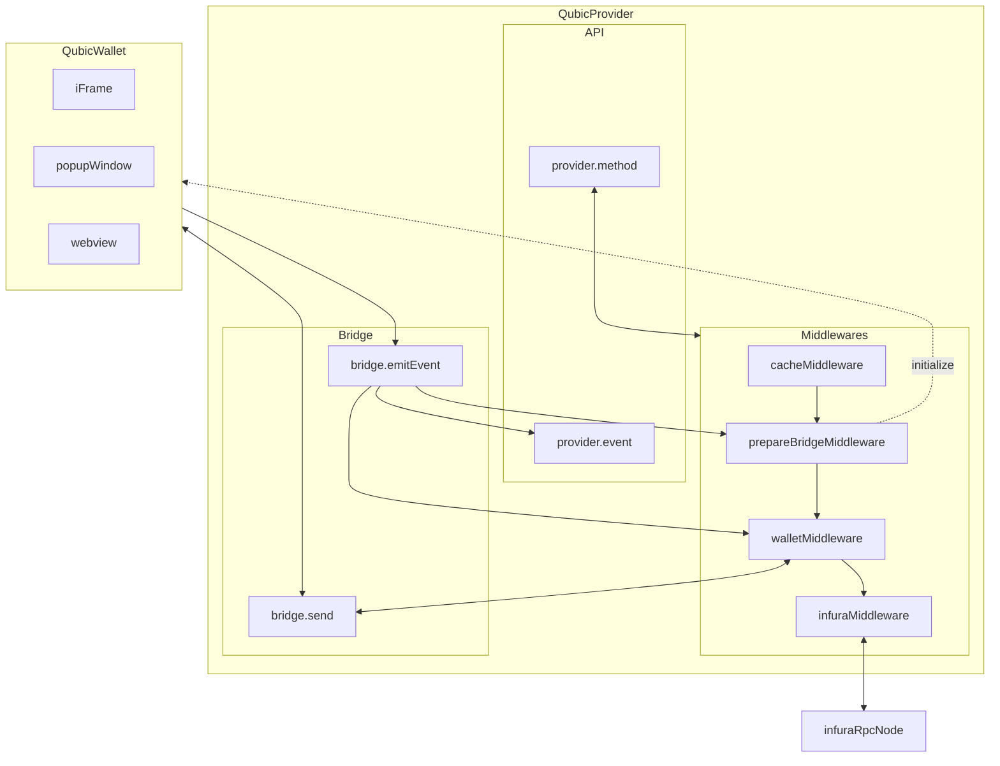

# Qubic SDK

## Demo

[https://qubic-js-sdk-example.netlify.app/](https://qubic-js-sdk-example.netlify.app/)

## Getting started

### Request an API key

Please [contact us](mailto:hello@qubic.app) or fill [this form](https://forms.gle/jYyw4ibn1VwG1w4X9).

### Installation

#### React

```shell
npm install @qubic-js/react
```

#### Javascript

```shell
npm install @qubic-js/browser
```

### Usage

```javascript
enum Network {
  MAINNET,
  ROPSTEN,
  RINKEBY,
  POLYGON,
  MUMBAI
}
```

#### React

```javascript
import Web3 from 'web3';
import { QubicConnector } from '@qubic-js/react';
import { Web3ReactProvider, useWeb3React } from '@web3-react/core';

const qubicConnector = new QubicConnector( {
  apiKey: API_KEY,
  apiSecret: API_SECRET,
  chainId: CHAIN_ID,
  infuraProjectId: INFURA_PROJECT_ID,
  // optional, default: false, when value is true, the popup will hide automatically
  autoHideWelcome: true
  // optional, default: false, when value is true, the show iframe instead of new window, credit card payment will failed with this option value true
  enableIframe: true
  // optional, default is `https://wallet.qubic.app/`
  walletUrl: 'https://wallet.qubic.app/',
  // optional, default is window.parent.location.href || window.location.href;
  inAppHintLink: 'https://www.google.com',
});

export default () => {
  const context = useWeb3React<Web3>();
  const { account, chainId, activate, library: web3 } = context;

  const handleSignIn = useCallback(async () => {
    activate(qubicConnector, (e: Error): void => {
      console.error(e);
    });
  }, [activate]);

  return (
    <Web3ReactProvider getLibrary={library}>
      <App />
    </Web3ReactProvider>
  );
}
```

#### Javascript

```javascript
import Web3 from 'web3';
import QubicProvider from '@qubic-js/browser';

const provider = new QubicProvider({
  apiKey: API_KEY,
  apiSecret: API_SECRET,
  chainId: Network.RINKEBY,
  infuraProjectId: INFURA_PROJECT_ID,
  enableIframe: true,
});

const web3 = new Web3(provider);
```

#### RPC APIs

##### eth_requestAccounts

Requests that the user provides an account to login. Returns a Promise that resolves to an array of a single Ethereum address string. If the user denies the request, the Promise will reject with a 4001 error.

```javascript
provider.request({ method: 'eth_requestAccounts' });
```

## Run Example

```cli
git clone git@github.com:getamis/qubic-js.git
cd qubic-js && yarn
cd example && yarn
yarn example
```

## Meta-transaction Standard

In Qubic, it's possible to execute a transaction by Qubic's relayer instead of user's wallet.

For Dapp developers, to integrate with Qubic's meta-transaction infrastructure, you have to

1. Follow Qubic's meta-transaction standard
2. Submit your Dapp's contract address to Qubic's whitelist.

## List of Solidity contract methods accpeted by Qubic

The `mint` functions for ERC721 below are supported.

```solidity
// 0x40c10f19 => mint(address,uint256)
function mint(address to, uint256 numberOfTokensOrTokenId);

// 0x6a627842 => mint(address)
function mint(address to);
```

The two functions below can be supported as well if the `onERC721Received` is invoked when transferring tokens.

```solidity
// 0x1249c58b => mint()
function mint();

// 0xa0712d68 => mint(uint256)
function mint(uint256 numberOfTokensOrTokenId);
```

```solidity
function onERC721Received(address operator, address from, uint256 tokenId, bytes data) returns (bytes4)
```

### Provider structure


