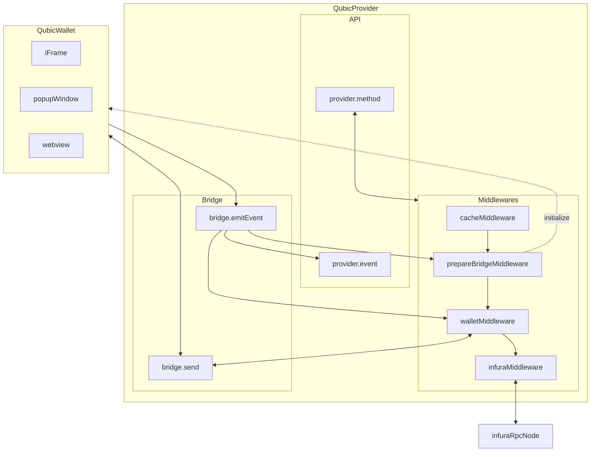

# AMIS Wallet SDK


<br />

# Demo

[https://qubic-js-sdk-example.netlify.app/](https://qubic-js-sdk-example.netlify.app/)

# Installation

### React

```cli
$ npm install @qubic-js/react
```

### Javascript

```cli
$ npm install @qubic-js/browser
```

# Usage

### React

```javascript
import Web3 from 'web3';
import { QubicConnector } from '@qubic-js/react';
import { Web3ReactProvider, useWeb3React } from '@web3-react/core';

const qubicConnector = new QubicConnector( {
  apiKey: API_KEY,
  apiSecret: API_SECRET,
  chainId: CHAIN_ID,
  infuraProjectId: INFURA_PROJECT_ID,
  // optional, default: false, when value is true, the popup will hide automatically
  autoHideWelcome: true
  // optional, default: false, when value is true, the show iframe instead of new window, credit card payment will failed with this option value true
  enableIframe: true
});

export default () => {
  const context = useWeb3React<Web3>();
  const { account, chainId, activate, library: web3 } = context;

  const handleSignIn = useCallback(async () => {
    activate(qubicConnector, (e: Error): void => {
      console.error(e);
    });
  }, [activate]);

  return (
    <Web3ReactProvider getLibrary={library}>
      <App />
    </Web3ReactProvider>
  );
}
```

### Javascript

```javascript
import Web3 from 'web3';
import QubicProvider from '@qubic-js/browser';

const provider = new QubicProvider({
  apiKey: API_KEY,
  apiSecret: API_SECRET,
  chainId: Network.RINKEBY,
  infuraProjectId: INFURA_PROJECT_ID,
  enableIframe: true,
});

const web3 = new Web3(provider);
```

## Run Example

```cli
$ git clone git@github.com:getamis/qubic-js.git
$ cd qubic-js
$ yarn example
```

# Features

## 更好的使用者入門體驗

### No Private Key

透過 TSS 技術，使用者無需自行保管私鑰，完整的私鑰也絕對不會出現在網路或任何儲存空間中。

不同於市面上其他替使用者保管私鑰的錢包，AMIS 錢包的使用者依然擁有完全的所有權，即便完整的私鑰不在使用者手中，但沒有使用者的簽名，任一方都無法將使用者的資產轉移。

## 更高的安全性

### HTSS 階層式門檻簽章

透過 AMIS 專利的 HTSS 技術，將私鑰拆分為多組 shares，分別交由使用者、可靠第三方與 AMIS 保管，即便任何一個 share 丟失，使用者的資產也無法被竊取。

若不幸 share 流出，可以透過 reshare 流程作廢舊的 share，重新取回安全的錢包。

# SDK Spec

## Enums & Types

### Network

```javascript
enum Network {
  MAINNET,
  ROPSTEN,
  RINKEBY,
  POLYGON,
  MUMBAI
}
```

## Initializer

### constructor

```javascript
// import QubicProvider from '@qubic-js/browser';
constructor(apiKey: string, apiSecret: string, network: Network, options): QubicProvider
```

初始化 Qubic 錢包客戶端

**_Params_**

- `apiKey`: 在 AMIS 後台申請 `apiKey`
- `apiSecret`: 在 AMIS 後台申請 `apiSecret`
- `network`: 目前提供 `MAINNET`、`RINKEBY`、 `POLYGON` 和 `MUMBAI`
- options
  - enableIframe: `true` 時，會使用 iframe 顯示，其他狀況是打開新視窗

**_Return_**

Web3 Provider

## Methods - Basic

串接 Qubic 錢包，包含內建的 Web UI

### eth_requestAccounts

```javascript
provider.request({ method: 'eth_requestAccounts' });
```

開啟 Social Login 登入流程

### Provider structure


